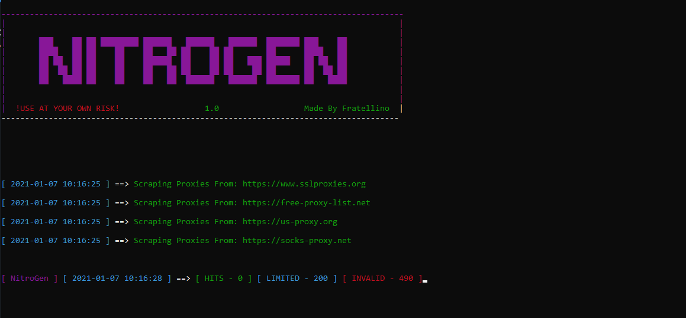

# Discord-Nitro-Generator 

**DISCLAIMER**: The code is for educational purposes only.

## Discord-Nitro-Generator features:
* Automated Proxy Scraper.
* Code Generator.
* Code Validity Checker.

  

## Performances:
* Fast Proxy Scraping
* 400/1500CPM
* Low RAM/NETWORK consuming

  

